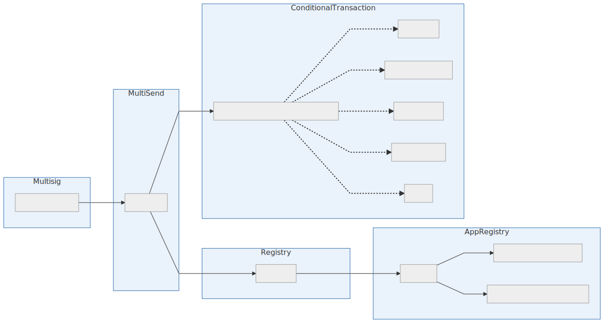

# Install Protocol

To illustrate the install protocol, first assume that the multisignature wallet owns 20 ETH and that the Free Balance application has recorded a balance of 10 ETH for both for Alice and Bob. Running the install protocol allows Alice and Bob to install an application where Alice and Bob both deposit 1 ETH to be disbursed based on the resolution logic of the application.

In this example, the application is Tic-Tac-Toe. You can see with the visual representation below that the funds available in the free balance decrease and the funds committed to the Tic-Tac-Toe application increase by the corresponding amount.

## Messages

When the application has been decided between both parties and a connection is established, the protocol for installing the application into the state channel is a single round-trip exchange of `Install` and `InstallAck` messages which include all information pertaining to the chosen deposit amounts of both parties, a pointer to the application being requested to be installed, and metadata such as the timeout and terms being agreed to.

### Types

First we introduce a new type which we label `InstallParams`.

**Type: `InstallParams`**

|          Field          |       Type       |                            Description                             |
| ----------------------- | ---------------- | ------------------------------------------------------------------ |
| `aliceBalanceDecrement` | `uint256`        | The proposed sub-deposit into the application of the first party   |
| `bobBalanceDecrement`   | `uint256`        | The proposed sub-deposit into the application of the second party  |
| `signingKeys`           | `address[]`      | TBD                                                                |
| `terms`                 | `Terms`          | The terms of agreement for this application                        |
| `initialState`          | JSON-like        | TBD                                                                |
| `appInterface`          | `CfAppInterface` | The definition of the interface of the application to be installed |
| `defaultTimeout`        | `uint256`        | The challenge period length for this application                   |

> NOTE: `signingKeys` are deterministically generated based on the nonce of the application in relation to the entire channel lifecycle. Further detail still to be provided in these specifications in the future. See [this issue](https://github.com/counterfactual/specs/issues/15) for discussion

> NOTE: At the moment, this message requires that the hexidecimal value of `peer1.address` is strictly less than the value of `peer2.address` to enforce deterministic ordering of the `signingKey` variable in new application installs. This can be improved in the future

### The **`Install`** Message

|     Field     |                         Description                         |
| ------------- | ----------------------------------------------------------- |
| `protocol`    | `"install"`                                                 |
| `multisig`    | The address of the on-chain Alice-Bob multisignature wallet |
| `params`      | An `InstallParams` object describing the proposed app       |
| `fromAddress` | The address of Alice                                        |
| `toAddress`   | The address of Bob                                          |
| `seq`         | `1`                                                         |
| `signature`   | Alice's signed commitment digest                            |

### The **`InstallAck`** Message

|     Field     |                         Description                         |
| ------------- | ----------------------------------------------------------- |
| `protocol`    | `"install"`                                                 |
| `multisig`    | The address of the on-chain Alice-Bob multisignature wallet |
| `data`        | An `InstallData` object describing the proposed app         |
| `fromAddress` | The address of Alice                                        |
| `toAddress`   | The address of Bob                                          |
| `seq`         | `2`                                                         |
| `signature`   | Bob's signed commitment digest                              |

## Commitments

**Commitment for `Install` and `InstallAck`**:

Let `c1` and `c2` be the amounts that parties 1 and 2 wish to contribute towards the application respectively. Then, the commitment should:

- Updates the state of the free balance application to one where the first party's balance is reduced by `c_1` and party the second party's balance should be reduced by `c_2`.
- Makes a delegatecall to `executeAppConditionalTransaction` with a limit of `c_1 + c_2` as also included in the terms.

The following parameters are included in the commitment:

|     Parameter      |   Type    |                                              Description                                              |
| ------------------ | --------- | ----------------------------------------------------------------------------------------------------- |
| **`uninstallKey`** | `bytes32` | Arbitrary value that the installed app's conditional transaction depends on inside the Nonce Registry |
| **`appStateHash`** | `bytes32` | The computed `keccak256` hash of the initial ABIEncoderV2 encoded state of the application            |

The commitment can be visually represented like:

> NOTE: Although not shown in the visualization, the order of transactions is important. The `multiSend` must encode the call to `proxyCall` **before** the call to `executeAppConditionalTransaction`.
