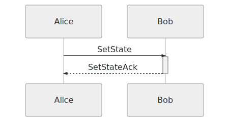
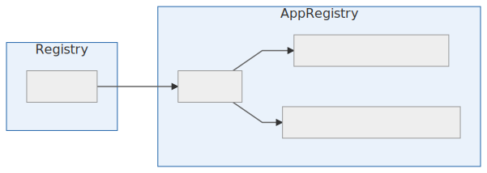

# Update Protocol


Once an application has been installed into the state channel, the multisignature wallet has transferred control over the installed amount from the free balance to the application's `resolve` function, a mapping from application state to funds distribution. For example, in the case of Tic-Tac-Toe, a possible payout function is: if X wins, Alice gets 2 ETH, else if O wins Bob gets 2 ETH, else send 1 ETH to Alice and Bob.

As the underlying state of the application changes, the result of the payout function changes. It is the job of the Update Protocol to mutate this state, independently of the rest of the counterfactual structure.

Using our Tic-Tac-Toe example, if Alice decides to place an X on the board, Alice would run the Update Protocol, transitioning our state to what is represented by the figure above. Notice how both the board changes and the _local_ nonce for the app is bumped from 0 to 1. To play out the game, we can continuously run the update protocol, making one move at a time.

## Messages



For the below messages, the digest that is signed is represented as the following:

```typescript
keccak256(
  ["bytes1", "bytes32", "bytes32", "uint256",
  [
    0x19,
    keccak256(encode(
      [address, address[], address, bytes32, uint256 ],
      [owner, signingKeys, appDefinitionAddress, termsHash, defaultTimeout]
    )),
    0,
    TIMEOUT
  ]
);
```

**Type: `UpdateParams`**

|      Field      |          Type          |     Description     |
| --------------- | ---------------------- | ------------------- |
| `appInstanceId` | `bytes32`              | Hashed App Identity |
| `newState`      | `AppState / JSON-like` | New state to set to |

### The **`SetState`** Message

|     Field     |           Description            |
| ------------- | -------------------------------- |
| `protocol`    | `"update"`                       |
| `params`      | An `UpdateParams` object         |
| `fromAddress` | The address of Alice             |
| `toAddress`   | The address of Bob               |
| `seq`         | `1`                              |
| `signature`   | Alice's signed commitment digest |

> TODO: Add a field for the encoded action

### The **`SetStateAck`** Message

|     Field     |          Description           |
| ------------- | ------------------------------ |
| `protocol`    | `"update"`                     |
| `fromAddress` | The address of Alice           |
| `toAddress`   | The address of Bob             |
| `seq`         | `2`                            |
| `signature`   | Bob's signed commitment digest |

## Commitments

**Commitment for `SetState` and `SetStateAck`**:

The commitment can be visually represented like:



This transaction invoke the `setState` function with the signatures exchanged during the protocol.
